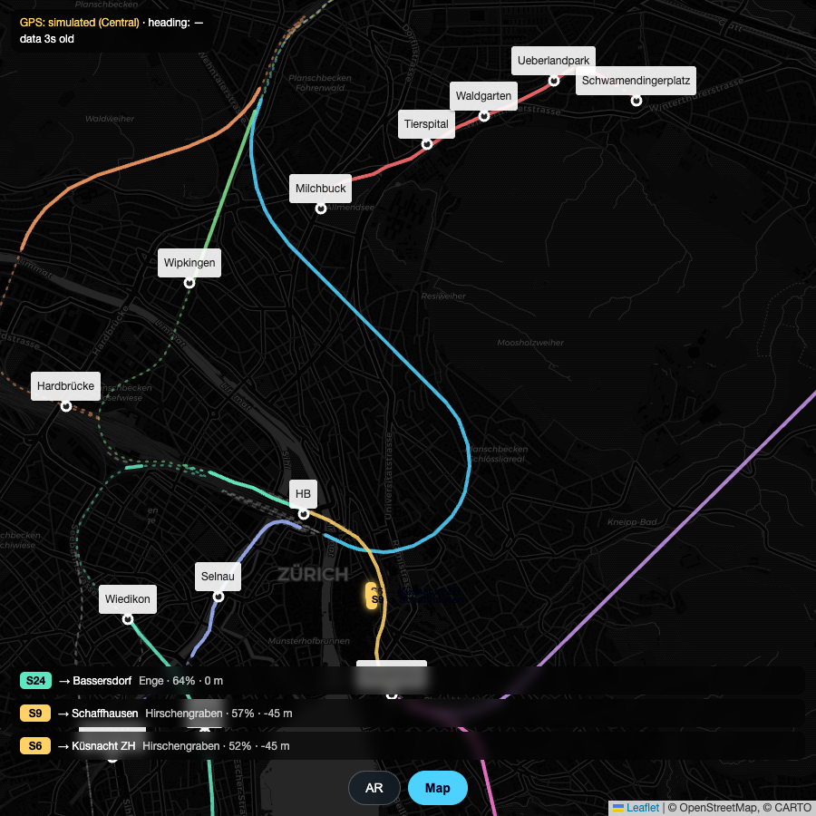
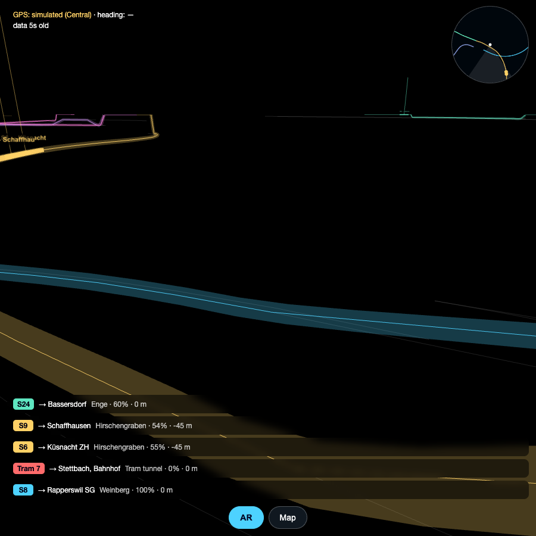

# Zurich Underground Trains AR

Point your phone at the ground in central Zurich and watch the S-Bahn, SZU and
tram traffic move through the tunnels beneath you — live.

| Map mode | AR mode |
| --- | --- |
|  |  |

## How it works

- **Corridors** (geometry from OpenStreetMap, ODbL — routed over the real track
  network by `build_data.py`, with per-point depth from tunnel/layer tags):
  - **Weinberg** (HB Löwenstrasse ↔ Oerlikon)
  - **Hirschengraben** (HB Museumstrasse ↔ Stadelhofen, under the Limmat)
  - **Zürichberg** (Stadelhofen ↔ Stettbach)
  - **Wipkingen line** (HB ↔ Wipkingen ↔ Oerlikon, the old tunnel)
  - **Käferberg** (Hardbrücke ↔ Oerlikon)
  - **Left bank** (HB ↔ Wiedikon ↔ Enge ↔ Wollishofen: Kohlendreieck, Ulmberg
    and Enge tunnels)
  - **Riesbach** (Stadelhofen ↔ Tiefenbrunnen)
  - **SZU** (HB deep platforms ↔ Selnau ↔ Giesshübel, under the Sihl)
  - **Tram tunnel Schwamendingen** (Milchbuck ↔ Tierspital ↔ Waldgarten ↔
    Ueberlandpark ↔ Schwamendingerplatz, trams 7 and 9)
  plus all other rail tunnels in the area as faint context lines.
- **Live trains** come from [transport.opendata.ch](https://transport.opendata.ch)
  station boards (15 stations around the corridors, including the separate
  `Zürich HB SZU` deep station), including delay prognosis. Stations a train
  passes *without* stopping (e.g. an IC through Oerlikon) appear in the API
  with empty times and are skipped, so those trains are tracked too. While the
  leg cache is empty (first load), arrival boards are polled as well — they
  list trains already inside the tunnels, so the view is populated immediately
  instead of only after the next departures. There is no GPS feed for trains
  in tunnels, so positions are interpolated along the corridor centerline
  between the timed stops, with accelerate/brake easing. Typically accurate to
  a handful of seconds.
- **AR view**: camera passthrough + WebGL overlay driven by GPS and the compass.
  Tunnels are drawn as glowing tubes at approximate depth, trains as moving
  blocks with a beacon line and a pulsing ring at street level, plus a north-up
  radar inset. **Map view** is a 2D fallback that works anywhere.

## Run it

```bash
python3 serve.py
```

- Desktop: open <http://localhost:8000> (Map mode; AR mode works with mouse-drag look
  and a simulated position at Central).
- Phone: open the printed `https://<your-mac-ip>:8443` URL **while on the same
  Wi-Fi**, accept the self-signed-certificate warning, then tap *Start AR* and
  allow camera, motion and location access.

Alternatively deploy the folder to any static host with HTTPS (GitHub Pages,
Netlify, …) — there is no backend.

## Using AR mode

- Stand anywhere between HB, Central and Stadelhofen for the densest traffic.
- Orientation tracking is gyro-driven, so the scene stays locked to the world
  while you turn. The compass only steers the north reference, slowly (a
  complementary filter), and it's often 10–30° off anyway. Tap **🎯 Align**, point the crosshair at the
  suggested landmark (Grossmünster, Prime Tower, the Uetliberg TV tower, … —
  the on-screen arrow tells you how far to turn) and confirm: the heading
  error is measured against the landmark's true bearing and corrected in one
  tap, permanently for the session. Swiping horizontally still fine-tunes.
- The radar (top right) shows tunnels and trains within ~700 m, north-up, with
  your view direction as a bright wedge.

## Rebuilding the geometry

`tunnels.js` is generated: see the header of `build_data.py` for the two
Overpass fetches, then `python3 build_data.py`. Corridors are routed over the
actual track graph (ways split at junctions, Dijkstra with a surface-cost
penalty so through-tunnel corridors pick the tube, waypoints for ambiguous
lines, operator-filtered subgraph for the SZU).

## Known approximations

- Depths come from OSM `layer` tags (−15 m per layer), not surveyed data, and
  are relative to your own ground plane, ignoring terrain.
- Trains that pass a station without stopping (e.g. S15 through Stettbach) get
  their leg length estimated from straight-line distance × 1.25.
- The stationboard API is polled every 150 s (rate limits); animation between
  polls is timetable-driven.
- Landmark heights for the aligner are rough estimates above local street
  level — only the *bearing* matters for calibration, so that's fine.

## Data licences

Map data © OpenStreetMap contributors (ODbL). Timetable data via
transport.opendata.ch (Opendata.ch). Base map tiles © CARTO.
